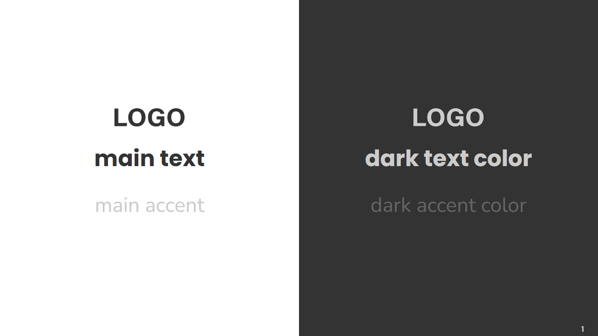

<!-- _class: slide-cover
_header: '' -->


# The Great Base Theme

## Step by step

<!-- 
Follow this guide to easily get started with Lupo's basic template.
-->

---
<!-- _class: slide-cover -->

# Your .MD File Basics 

## The First Steps 

<!-- 
Let's start with what you can do in your markdown file. 
-->

---
<!-- _class: slide-demo -->

# Front-Matter Syntax

<contentarea>

- Made of global directives
- Always the first thing in the .md file
    -   Between dash rulers


<codetext>

```
---
marp: true
theme: basetheme
paginate: true
footer: Replace this with your desired footer text                                                 
header: ''
---
```

</codetext>

</contentarea>


<!-- 
"Front-matter" in Marp presentations refers to a block of metadata that is placed at the very beginning of your Markdown file and between the dash rulers.

It typically includes information like:
Theme: Specifies the theme to be used for the slides.
Paginate: Determines whether to show page numbers on the slides.
Footer: Sets the content of the footer for each slide.
Header: Specifies the content of the header for each slide.
Marp: Indicates that the content is intended for Marp processing.
-->

---
<!-- _class: slide-header-halfleft-halfright 
backgroundColor: teal-->

# Directives

<left style="text-align: left; align-items: start;">

**Local Directives**

- A type of directive
- Applies to:
    - The current slide
    - And following slides
- Written as comments

<codetext>

```
<!-- _class: slide-header-halfleft-halfright 
_backgroundColor: teal-->

This page has a teal background.                        

---

The second page also has same color.
```

</codetext>

</left>

<!-- 
Then you could use "local directives", this will make changes to the slide you are applying it to and to all the following slides. These are written as comments at the beggining of the slide.

As an example you can see the result of "background color" colon teal which would make this slide and all the slides following color teal -->

---
<!-- _class: slide-header-halfleft-halfright 
_backgroundColor: violet-->

# Directives

<left style="text-align: left; align-items: start;">

**Local Directives**

- A type of directive
- Applies to:
    - The current slide
    - And following slides
- Written as comments

<codetext>

```
<!-- backgroundColor: teal -->

This page has a teal background.                         

---

The second page also has same color.
```

</codetext>

</left>

<right>

**Spot Directives**

- A type of *local* directive
- Applies to
    - **ONLY** the current slide 
- Must be written as a comment but with an underscore

<codetext>

```
<!-- _backgroundColor: violet -->

Add underscore prefix `_` to the name of local directives.

---

The second page would not apply setting of directives.
```

</codetext>

</right>

<!-- 
You can use "spot directives" if you want to apply it only to the slide you are corrently on, it's the same to "local directives" but with an underscore at the beginning.
In this case you can see that we used underscore "background color" colon violet, which makes only this slide color violet, the next slides will go back to color teal.
-->

---
<!-- _class: slide-definition -->

# Why does this slide is still color Teal?

The violet was a spot directive, it only affected the previous slide.
We used a local directive to set it to Teal, which affects all the slides from that one on.


<!-- 
But, wait a moment, why does this slide has a teal background color?

The violet was a spot directive, it only affected the previous slide. And, we used a local two slides back setting the background color to Teal, which affects all the slides from that one on.
-->


---
<!-- _class: slide-header-content 
backgroundColor: "" -->

# Let's fix it

<contentarea>

<codetext>

```
<!-- backgroundColor: "" -->                  
```

</codetext>

</contentarea>


<!-- Let's fix it using a local directive again and setting the background color to empty double qoutes, the same trick if you want to remove the footer or header -->

---
<!-- _class: slide-header-onethirdleft-twothirdsright -->

# Directives

<left style="text-align: right; right-margin: 0">

paginate
header
footer
class
backgroundColor
backgroundImage

</left>

<right>

Show page number on the slide if you set true.
Specify the content of slide header.
Specify the content of slide footer.
Specify HTML class of slide’s `<section>` element.
Setting background-color style of slide.
Setting background-image style of slide.

</right>

<!-- 
These are the local directives available. You can turn on and off the pagination of each slide independently. 
The header for this sample theme is space designated for placing a logo, depending on the color of the background it might not be visible, in this cases you could have another version of your logo in a color that has better contrast and use it in the slides with color issues as a spot directive. 
In the footer you can add a piece of text.
The class local directive is similar to the name of the template you want to apply to the slide, it defines how different elements like the headers, text and background colors will show up, I'll detail this in the next slides.
We already saw an example of how background color works, which explains why we currently have a teal colored background.
-->

---
<!-- _class: slide-header-onethirdleft-twothirdsright 
_backgroundImage: 'url(media/backgroundimageexample.png)'
-->

# Directives

<left style="text-align: right; right-margin: 0">

paginate
header
footer
class
backgroundColor
backgroundImage

</left>

<right>

Show page number on the slide if you set true.
Specify the content of slide header.
Specify the content of slide footer.
Specify HTML class of slide’s `<section>` element.
Setting background-color style of slide.
Setting background-image style of slide.

</right>

<!-- 
Also, instead of using background colors, you could use a background image for a more complex background, for example this slide uses a background image.
-->

---
<!-- 
_class: slide-cover
-->

# The Templates

## AKA Class Local Directive 

<!-- 
Now, let me explain how you can call the templates
-->

---

<!-- _class: slide-header-subheader-content -->

# Premade Class Local Directives

## Or your templates

<contentarea>

<codetext>

```
<!-- _class: slide-test-colors -->
<!-- _class: slide-cover -->
<!-- _class: slide-onethirdleft-twothirdsright -->
<!-- _class: slide-header-onethirdleft-twothirdsright -->                                          
<!-- _class: slide-header-halfleft-halfright -->
<!-- _class: slide-definition -->
<!-- _class: slide-header-content -->
<!-- _class: slide-header-subheader-content -->
<!-- _class: slide-image-rightnote -->
<!-- _class: slide-image-centerednote -->
<!-- _class: slide-thanks -->
<!-- _class: slide-video -->
<!-- _class: slide-demo -->
```

</codetext>

</contentarea>


<!-- 
These are the class local directives that are already defined for you in the .css file, think of these as the templates of the slides.
-->

---

<!-- _class: slide-header-subheader-content
_footer: "" 
_header: "" 
_paginate: false 
_backgroundColor: cadetblue -->

# Premade Class Local Directives

## Or your templates

<codetext>

```
<!-- _class: slide-header-subheader-content                                                        
_footer: "" 
_header: "" 
_paginate: false 
_backgroundColor: cadetblue -->   
```

</codetext>

<!-- 
You can add more than one local directive to a slide, just write each one in an independent line, like this. If you want to leave the footer or header empty just write two double qoutes. You can also add a background image for an even more personalized look.
-->

---

<!-- _class: slide-cover -->

# Let's Make It Look Personalized

## By adding your fonts and colors

<!-- 
This base template has been designed so that with just a couple of changes to the .CSS, your presentation will look more personalized.
-->

---


<!-- _class: slide-header-onethirdleft-twothirdsright -->

# Leave Theses Lines Alone!

<contentarea style="font-size: pt;">

```
@import 'default';

/* required for video, do not delete */
video {
    position: fixed;
    right: 0;
    bottom: 0;
    min-width: 100%;
    min-height: 100%;
}

img {
    background-color: transparent !important;                                                      
    object-fit: cover;
    display: flex;
    align-items: center;
    justify-content: center;
}
```

</contentarea>

<!-- 
Start by opening the file basetheme.css. inside the folder "themes".
When you open it, at the beginnig you will see an @import and a comment that says "required for video, do not delete". These lines are important for the theme and video functionality. Please don't modify them.
-->

---
<!-- _class: slide-header-onethirdleft-twothirdsright -->

# We make it easier for you

<left>

<codetext>

``` css
/* Replace with your font */
@import url('https://fonts.googleapis.com/
css2?family=Nunito:wght@300;400;500;700&fa
mily=Roboto+Mono:wght@300;400;500;700&famil
y=Roboto+Slab:wght@300;400;500;700&family=R
oboto:wght@300;400;500;700&display=swap');

/* Replace with your font and colors */
:root {
    --primary-font: 'Poppins', sans-serif;
    --secondary-font: 'Nunito', sans-serif;
    --code-font: 'Roboto Mono', monospace;

    --lightmode-background: #FFFFFF;
    --lightmode-text: #333333;
    --lightmode-accent: #CCCCCC;
    --darkmode--background: #333333;
    --darkmode--text: #CCCCCC;
    --darkmode--accent: #666666;
}
```

</codetext>

</left>

<right>

1. Add your font:
    1. Replace the `@import url` link
    1. Or use the `@font-face` rule
1. Replace:
    1. Font names 
        1. Poppins, Nunito, and Roboto Mono
    2. HEX code of colors 
        1. #FFFFFF, #333333, #CCCCCC, #333333, #CCCCCC, and #666666
1. Save the CSS file.
1. Fonts and colors should be updated

</right>

<!-- 
To use the colors and fonts of your choice go to the "base theme css". There, around line 23, you will see a section where you can add your font and colors that looks like the image on the left. 

If you're using a font hosted by services like Google Fonts, just replace the link inside the "@ import url". However, if you're using a font that you're hosting yourself, you can use the "@ font face" rule.

Now, start changing the names of the fonts (in this example Poppins, Nunito, and Roboto Mono) and the HEX code of the colors.

"Primary font" refers to the font used in headers. "Secondary font" is the font used in sub headers and in regular text.  "Code font" is the font that is going to display in case you show code or code blocks.

About the colors, there are main and dark. Main are the ones shown as a light theme, dark refers to the colors uses as if it was a dark theme. So "main background", "main text", and "main accent" would be the colors displayed in your light theme background, light theme text and light theme accent. While "dark background", "dark text", and "dark accent" would be the colors displayed in your dark theme background, light theme text and light theme accent.

Important, don't change the name after the two dashes, only change the name of the font. These names are used all around the CSS to call the fonts and colors you want to use, if you change this names, youir style wont display correctly.
-->


---
<!-- _class: slide-header-subheader-content -->

# This Slide Will Help you test colors

## `<!-- _class: slide-test-colors -->`

<contentarea style="align-items: center; justify-content: center;">



</contentarea>

<!-- 
This slide called "test colors" will help you test how text and logos wil look over background colors. To be able to see the logos replace the files in sample/media called logo-dark.png and logo-light.png with your logos in dark color and light colors.
-->


---
<!-- _class: slide-cover -->

# Base Theme Templates

## Two Ways to Use Them

<!-- 
You can use preset templates in two different way, copy-pasting or snippets
-->

---
<!-- _class: slide-header-halfleft-halfright -->

# 1. Copy and Paste

<left>

`base-theme-sample.md`


</left>

<divline> </divline>

<right>

1. Open the `base-theme-sample.md` file 
1. Look for the template you want to use and copy it
1. Open the `.md` file you are working on and paste
1. Replace with your text 

* Pros: 
    * You can visually see what you will get
    * Have an example of contents

* Cons:
    * If the file is modified you loose the accurate preview

</right>

<!-- 
As the title says, open the `base-theme-sample.md` file and copy and paste the template you want to use
* Pros: 
    * You can visually see what you will get
    * Have an example of contents

* Cons:
    * If the file is modified you loose the accurate preview
-->

---
<!-- _class: slide-header-halfleft-halfright -->

# 2. Snippets

<left>

IMAGE PENDING

</left>

<divline> </divline>

<right>

1. Type `slide-`  
2. Press Enter or Tab
1. Select the slide you want to use from the list
3. And start replacing the prompted text with what you want to show

* Pros: 
    * The original templates are not easy to modify
    * You will be prompted one by one which element to fill out

* Cons:
    *  You need at least an idea of the name of the template you want to use

</right>

<!-- 
The other option is using snippets, to create snippets first type "slide dash" and press Enter or Tab, select the slide you want to use from the list, and start replacing the prompted text with what you want to show.


* Pros: 
    * The original templates are not easy to modify
    * You will be prompted one by one which element to fill out

* Cons:
    *  You need at least an idea of the name of the template you want to use
-->


---
<!-- _class: slide-cover -->

# What if things don't fit

## You can make extra adjustments

<!-- 
If for example, a header is too long and it falls out of the designated area you can make modifications in your markdown or even in your css.
-->

---

<!-- _class: slide-onethirdleft-twothirdsright -->

<left>

# .MD Accepts html

</left>

<divline> </divline>

<right>

If you write this: 
`This text is very important and I need to make it more striking`

You will get this: 
This text is very important and I need to make it more striking
<br>
If you write this: 
`<p style="font-size: 40px; color: red; font-weight: bold; text-transform: uppercase;"> This text is very important and I need to make it more striking </p>`

You will get this: 
<p style="font-size: 40px; color: red; font-weight: bold; text-transform: uppercase;"> This text is very important and I need to make it more striking </p>

</right>

<!-- Markdown and CSS alone have their limitations, luckily, theres html. You can make a mix of markdown and html to help you design better slides.
You can see one case in some of the already prepared slide templates, where you can see elements like <left> or <right> to organize the text or elements inside columns. 
Also in some cases, you might want to display one piece of text different to the rest of the presentation, you can use html to modify the font size, take a look at the example on the slide.
The first sentence "This text is very important and I need to make it more striking" displays as it would be displayed by default. But if I use html with inline css to add the style and set a font size, color, a font weight, and set it to show in uppercase I get a different result, making my text show more striking.
 -->

---

<!-- _class: slide-onethirdleft-twothirdsright -->

<left>

# Or modify the css

</left>

<divline> </divline>

<right>

IMAGE PENDING

</right>

<!-- 
You can also modify font size of different elements from the .CSS, this requires a lot more attention to detail and previous knowledge on css, but the basic or most general sizes are set at the beginning
-->

---

<!-- _class: slide-thanks -->

## Do you have any questions?

### help@lupo.ai 

<!-- 
If you have any questions feel free to log into your account and check our documentation, you can also write an email to help at lupo dot a i. 
-->